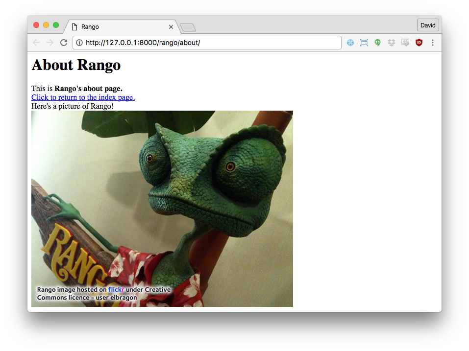
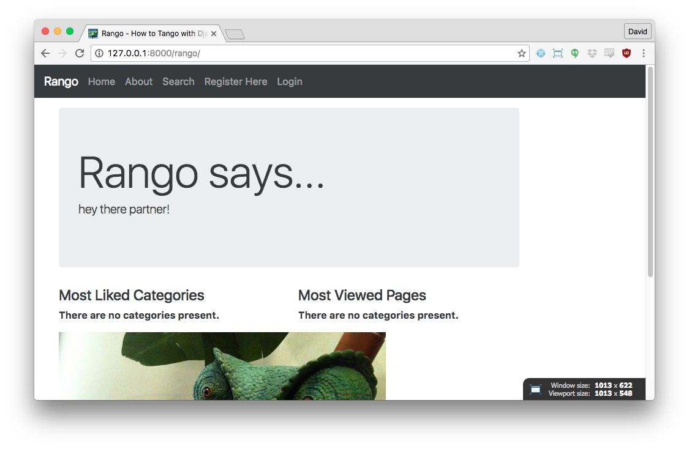
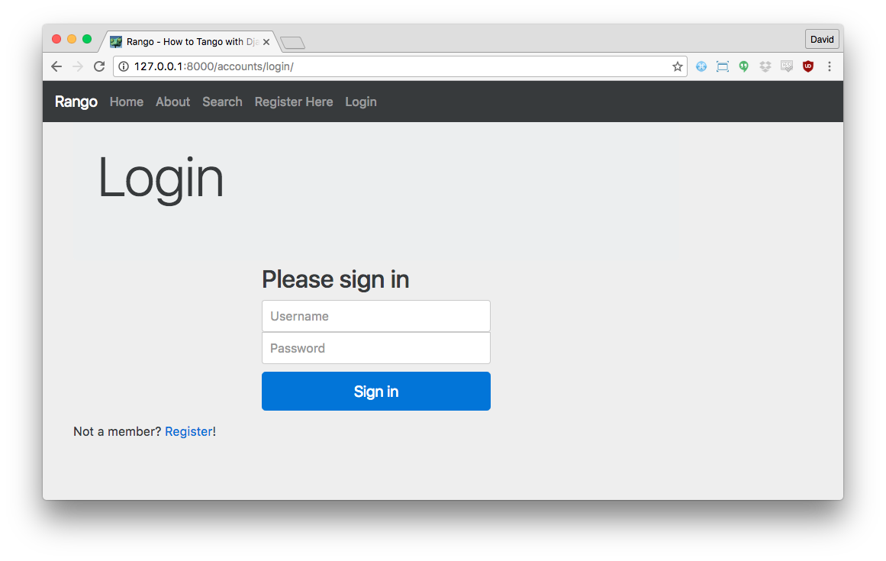
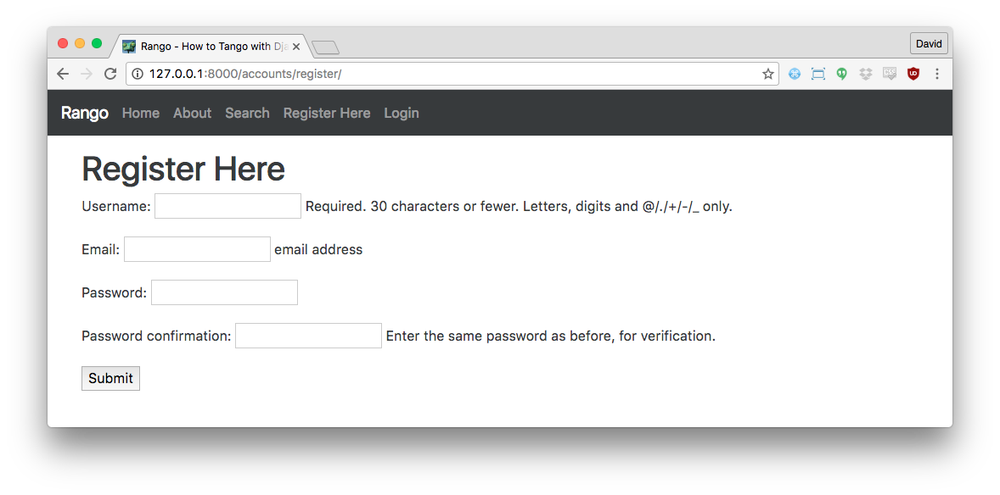

#Bootstrapping Rango {#chapter-bootstrap}
In this chapter, we will be styling Rango using the *Twitter Bootstrap 4 Alpha* toolkit. Bootstrap is the most popular HTML, CSS, JS Framework, which we can use to style our application. The toolkit lets you design and style responsive web applications, and is pretty easy to use once you get familiar with it.

I> ### Cascading Style Sheets
I>
I> If you are not familiar with CSS then you should check out the [CSS Chapter](#chapter-css) where we provide a quick guide on the basics of Cascading Style Sheets.

Now take a look at the [Bootstrap 4.0
website](http://v4-alpha.getbootstrap.com/) - it provides you with sample code
and examples of the different components and how to style them by added
in the appropriate style tags, etc. On the Bootstrap website they
provide a number of [example
layouts](http://v4-alpha.getbootstrap.com/examples/) which we can
base our design on.

To style Rango we have identified that the [dashboard
style](http://v4-alpha.getbootstrap.com/examples/dashboard/) more or less meets
our needs in terms of the layout of Rango, i.e. it has a menu bar at the
top, a side bar (which we will use to show categories) and a main
content pane. 

Download and save the HTML source for the Dashboard layout to a file called, `base_bootstrap.html` and save it to your `templates/rango` folder.

Before we can use the template we need to modify the HTML so that we can use it in our application.
The changes that we performed are listed below along with the updated HTML (so that you don't have to go to the trouble).

-   Replaced all references of `../../` to be `http://v4-alpha.getbootstrap.com/`
-   Replaced `dashboard.css` with the absolute reference,
    `http://getbootstrap.com/examples/dashboard/dashboard.css`
-   Removed the search form from the top nav bar
-   Stripped out all the non-essential content from the html and
    replaced it with ``
-   Set the title element to be,
    `<title>Rango - How to Tango with Django!</title>`
-   Changed `project name` to be `Rango`.
-   Added the links to the index page, login, register, etc to the top
    nav bar.
-   Added in a side block, i.e., ``
- Added in `` after the `DOCTYPE` tag.
- Downloaded the [Rango Favicon](https://github.com/leifos/tango_with_django_19/blob/master/code/tango_with_django_project/static/images/favicon.ico) and saved it to `static/images/` and then updated the `<link>` tag to be `<link rel="icon" href="">`.

##The New Base Template

{lang="html",linenos=off}
	<!DOCTYPE html>
	
	
	<html lang="en">
	<head>
		<meta charset="utf-8">
		<meta http-equiv="X-UA-Compatible" content="IE=edge">
		<meta name="viewport" content="width=device-width, 
				initial-scale=1, shrink-to-fit=no">
		<meta name="description" content="">
		<meta name="author" content="">
		<link rel="icon" href="">
		<title>Rango - How to Tango with Django!</title>
		<!-- Bootstrap core CSS -->
		<link href="http://v4-alpha.getbootstrap.com/dist/css/bootstrap.min.css" 
			rel="stylesheet">
		<!-- Custom styles for this template -->
		<link href="http://v4-alpha.getbootstrap.com/examples/dashboard/dashboard.css" 
			rel="stylesheet">
	</head>
	<body>
	<nav class="navbar navbar-dark navbar-fixed-top bg-inverse">
		<button type="button" class="navbar-toggler hidden-sm-up"
			data-toggle="collapse" data-target="#navbar" 
			aria-expanded="false" aria-controls="navbar">
			Toggle navigation
			
			
			
		</button>
		<a class="navbar-brand" href="#">Rango</a>
		

			<nav class="nav navbar-nav pull-xs-left">
			<a class="nav-item nav-link" href="">Home</a>
			<a class="nav-item nav-link" href="">About</a>	
			<a class="nav-item nav-link" href="">Search</a>
			
			<a class="nav-item nav-link" 
				href="">
					Add a New Category</a>
			<a class="nav-item nav-link" 
				href="?next=/rango/">Logout</a>
			
			<a class="nav-item nav-link" 
				href="">Register Here</a>
			<a class="nav-item nav-link" 
				href="">Login</a>
			
			</nav>
		

	</nav>
	

		

		

			
				
			
		

		

			
		

		

	

	<!-- Bootstrap core JavaScript
		================================================== -->
		<!-- Placed at the end of the document so the pages load faster -->
		
		
		
		<!-- Just to make our placeholder images work.
			 Don't actually copy the next line! -->
		
		<!-- IE10 viewport hack for Surface/desktop Windows 8 bug -->
		
	</body>
	</html>

If you take a close look at the modified Dashboard HTML source, you'll notice it
has a lot of structure in it created by a series of `
` tags.
Essentially the page is broken into two parts - the top navigation bar which is contained by `<nav>` tags, and the main content pane denoted by the `
` tag. Within the main content pane, there are two `
`s, one for the sidebar and the other for the main content, where we have placed the code for the `sidebar_block` and `body_block`, respectively.	
	
In this new template, we have assumed that you have completed the chapters on User Authentication and used the Django Regisration Redux Package. If not you will need to update the template and remove/modify the references to those links in the navigation bar i.e. in the `<nav>` tags. 
	
Also of note is that the HTML template makes references to external websites to request the required `css` and `js` files. So you will need to be connected to the internet for the style to be loaded when you run the application.

I> ###Working Offline?
I>
I> Rather than including external references to the `css` and `js` files, 
I> you could download all the associated files and store them in your
I> static folder. If you do this, simply update the base template to
I> reference the static files stored locally. 

	
##Quick Style Change
To give Rango a much needed facelift, we can replace the content of the existing `base.html` with the HTML template code in `base_bootstrap.html`. You might want to first comment out the existing code in `base.html` and then cut-and-paste in the `base_bootstrap.html` code.

Now reload your application. Pretty nice, hey!

You should notice that your application looks about a hundred times better already. Below we have some screen shots of the about page showing the before and after.

Flip through the different pages. Since they all inherit from base, they will all be looking pretty good, but not perfect! In the remainder of this chapter, we will go through a number of changes to the templates and use various Bootstrap classes to improve the look and feel of Rango.

<!--
## Page Headers
Now that we have the `base.html` all set up and ready to go, we can do a
really quick face lift to Rango by going through the Bootstrap
components and selecting the ones that suit the pages.

Let's start by updating all our templates by adding in the class `page-header` to the `<h1>` title tag at the top of each page. For example the `about.html` would be updated as follows.

{lang="html",linenos=off}
	
	
	
		About
	
	
	
		

		<h1 class="page-header">About Page</h1>			
			This tutorial has been put together by: leifos and maxwelld90 
		
	
		 
	

This doesn't visually appear to change the look and feel, but it informs the toolkit what is the title text, and if we change the theme then it will be styled appropriately.

-->

### The Index Page
For the index page it would be nice to show the top categories and top pages in two separate columns. Looking at the Bootstrap examples, we can see that in the [Narrow Jumbotron](http://v4-alpha.getbootstrap.com/examples/narrow-jumbotron/) they have an example with two columns. If you inspect the source, you can see the following HTML which is responsible for the columns.

{lang="html",linenos=off}
	

		

			<h4>Subheading</h4>
			
Donec id elit non mi porta gravida at eget metus. 
				Maecenas faucibus mollis interdum.

			<h4>Subheading</h4>
		

		

			<h4>Subheading</h4>
			
Donec id elit non mi porta gravida at eget metus. 
				Maecenas faucibus mollis interdum.

		

	

Inside the `
`, we can see that it contains two `
`'s with classes `col-lg-6`. Bootstrap is based on a [grid layout](http://v4-alpha.getbootstrap.com/layout/grid/), where each container is conceptually broken up into 12 units. The `col-lg-6` class denotes a column that is of size 6, i.e. half the size of its container, `
`.
	
Given this example, we can create columns in `index.html`  by updating the template as follows.
	

{lang="html",linenos=off}
	
	
	
		Index
	
	
	

		<h1 class="display-3">Rango says...</h1>
				
			<h1>hey there {{ user.username }}!</h1>
		
			<h1>hey there partner! </h1>
		
	

	

		

		<h4>Most Liked Categories</h4>
		

		
		<ul>
			
			<li><a href="">
				{{ category.name }}</a></li>
			
		</ul>
		
			<strong>There are no categories present.</strong>
		
		

		

		

			<h4>Most Viewed Pages</h4>
			

			
			<ul>
				
				<li><a href="{{ page.url }}">{{ page.title }}</a></li>
				
				</ul>
			
				<strong>There are no categories present.</strong>
			 
			

		

	
	
	 	
	
	
We have also used the `jumbotron` class to make the heading in the page more evident by wrapping the title in a `
`. Reload the page - it should look a lot better now, but the way the list items are
presented is pretty horrible. 

Let's use the [list group styles provided by
Bootstrap](http://v4-alpha.getbootstrap.com/components/list-group/) to improve how they look. We can do this quite easily by changing the
`<ul>` elements to `<ul class="list-group">` and the `<li>` elements to
`<li class="list-group-item">`.

###The Login Page
Now let's turn our attention to the login page. On the Bootstrap website
you can see they have already made a [nice login
form](http://v4-alpha.getbootstrap.com/examples/signin/). If you take a look at the
source, you'll notice that there are a number of classes that we need to
include to pimp out the basic login form. Update the `body_block` in the `login.html`
template as follows:

{lang="html",linenos=off}
	
	<link href="http://v4-alpha.getbootstrap.com/examples/signin/signin.css"
		rel="stylesheet">
	

		<h1 class="display-3">Login</h1>
	

	<form class="form-signin" role="form" method="post" action=".">
		
		<h2 class="form-signin-heading">Please sign in</h2>
		<label for="inputUsername" class="sr-only">Username</label>
		<input type="text" name="username" id="id_username" class="form-control" 
			placeholder="Username" required autofocus>
		<label for="inputPassword" class="sr-only">Password</label>
		<input type="password" name="password" id="id_password" class="form-control"
			placeholder="Password" required>
		<button class="btn btn-lg btn-primary btn-block" type="submit" 
			value="Submit" />Sign in</button>
	</form>
	

Besides adding in a link to the bootstrap `signin.css`, and a series of
changes to the classes associated with elements, we have removed the
code that automatically generates the login form, i.e. `form.as_p`.
Instead, we took the elements, and importantly the id of the elements
generated and associated them with the elements in this bootstrapped
form.

In the button, we have set the class to `btn` and `btn-primary`. If you
check out the [Bootstrap section on
buttons](http://v4-alpha.getbootstrap.com/components/buttons/) you can see there are
lots of different colours that can be assigned to buttons.

### Other Form-based Templates

You can apply similar changes to `add_cagegory.html` and `add_page.html`
templates. For the `add_page.html` template, we can set it up as
follows.

{lang="html",linenos=off}
	
	Add Page
	
	
		
			<form role="form" id="page_form" method="post" 
				action="/rango/category/{{category.slug}}/add_page/">
			<h2 class="form-signin-heading"> Add a Page to 
				<a href="/rango/category/{{category.slug}}/"> 
					{{ category.name }}</a></h2>
			
			
				{{ hidden }}
			
			
				{{ field.errors }}
				{{ field.help_text }} 
				{{ field }} 
			
			 
			<button class="btn btn-primary"
				type="submit" name="submit">
					Add Page</button>
			</form>
		
			
This is category does not exist.

		
	

X> ###Exercise 
X>
X> - Create a similar template for the Add Category page called `add_category.html`.

###The Registration Template
For the `registration_form.html`, we can update the form as follows:

{lang="python",linenos=off}
	
	
	<form role="form"  method="post" action=".">
		
		<h2 class="form-signin-heading">Sign Up Here</h2>
		

			
 
				<label for="id_username">Username:</label>
				<input class="form-control"  id="id_username" maxlength="30" 
					name="username" type="text"
						placeholder="Enter username"/>

	

	

		

			<label for="id_email">E-mail:</label>
			<input class="form-control" id="id_email" 
				name="email" type="email"
					placeholder="Enter email" />

		

		

			

				<label for="id_password1">Password:</label>
				<input class="form-control" id="id_password1" 
					name="password1" type="password" 
						placeholder="Enter password" />

			

			

				

					<label for="id_password2">Password (again):</label>
					<input class="form-control" id="id_password2" 
						name="password2" type="password" 
							placeholder="Enter password again" />

				

		<button type="submit" class="btn btn-default">Submit</button>
	</form>
	

Again we have manually transformed the form created by the
`{{ form.as_p }}` template tag, and added the various bootstrap classes.

I> ###Bootstrap, HTML and Django Kludge
I>
I> This is not the best solution - we have kind of kludged it together. 
I> It would be much nicer and cleaner if we could instruct Django when building the HTML for the form to insert the appropriate classes.

##Using `Django-Bootstrap-Toolkit`
An alternative solution would be to use something like the `django-bootstrap-toolkit` see
<https://github.com/dyve/django-bootstrap-toolkit>. To install the `django-bootstrap-toolkit` run, `pip install django-bootstrap-toolkit`. Add, `bootstrap_toolkit` to the `INSTALLED_APPS` tuple in `settings.py`. 

To use the toolkit within our templates, we need to first load the toolkit `` and then call the function that updates the generated HTML, i.e. 
`{{ form|as_bootstrap }}`. Applying this solution to the `category.html` template, we arrive at the following.

{lang="html",linenos=off}
	
	
	
	Add Category
	
		<form id="category_form" method="post" 
			action=""\>
		<h2 class="form-signin-heading"\>Add a Category</a></h2>
		
		{{ form|as_bootstrap }}
		 
		<button class="btn btn-primary" type="submit"
			name="submit"\>Create Category\</button\>
		</form>
	

This solution is much cleaner, and automated. However, it does not
render as nicely as the first solution. So it needs some tweaking to customise it as required, but we will let you figure it out :-).

###Next Steps
In this chapter we have described how to quickly style your Django application using the Bootstrap toolkit. Bootstrap is highly extensible and it is relatively easy to change themes - check out the [StartBootstrap Website](http://startbootstrap.com/) for a whole series of free themes. Alternatively, you might want to use a different CSS toolkit like [Zurb](http://zurb.com). Now that you have an idea of how to hack these templates and integrate them into your Django applications to make them look slick and modern.

Now that Rango is starting to look better we can go back and add in the
extra functionality that will really pull the application together.

